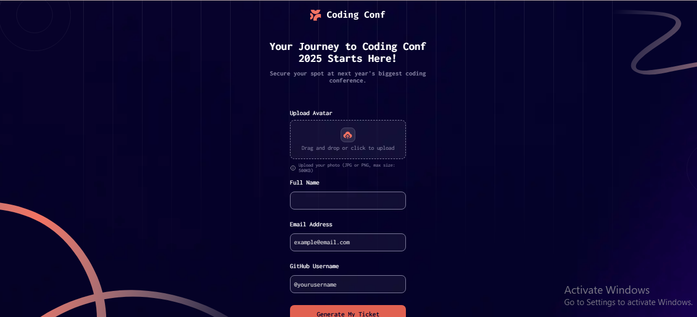

# Frontend Mentor - Conference ticket generator solution

This is a solution to the [Conference ticket generator challenge on Frontend Mentor](https://www.frontendmentor.io/challenges/conference-ticket-generator-oq5gFIU12w). Frontend Mentor challenges help you improve your coding skills by building realistic projects. 

## Table of contents

- [Overview](#overview)
  - [The challenge](#the-challenge)
  - [Screenshot](#screenshot)
  - [Links](#links)
- [My process](#my-process)
  - [Built with](#built-with)
  - [What I learned](#what-i-learned)
  - [Continued development](#continued-development)
  - [Useful resources](#useful-resources)
- [Author](#author)

## Overview

### The challenge

Users should be able to:

- Complete the form with their details
- Receive form validation messages if:
  - Any field is missed
  - The email address is not formatted correctly
  - The avatar upload is too big or the wrong image format
- Complete the form only using their keyboard
- Have inputs, form field hints, and error messages announced on their screen reader
- See the generated conference ticket when they successfully submit the form
- View the optimal layout for the interface depending on their device's screen size
- See hover and focus states for all interactive elements on the page

### Screenshot



### Links

- Solution URL: *[Add solution URL here](https://your-solution-url.com)*
- Live Site URL: *[Add live site URL here](https://your-live-site-url.com)*

## My process

### Built with

- Semantic HTML5 markup
- CSS custom properties
- Flexbox
- CSS Grid
- JavaScript (Vanilla)

### What I learned

One of the key things I learned while building this project was how to use the `dragenter` and `dragleave` events in JavaScript. These allowed me to create a smoother drag-and-drop experience for the avatar upload.

```js
dropArea.addEventListener("dragenter", () => {
  dropArea.classList.add("highlight");
});

dropArea.addEventListener("dragleave", () => {
  dropArea.classList.remove("highlight");
});
```


### Continued development

I’d like to continue improving the responsiveness of the layout. It was particularly challenging to work with the SVG pattern used as the ticket background, but I managed to get it looking close to the design. Still, there’s room for better scaling across different screen sizes.

### Useful resources

I didn’t use any tutorials for this challenge — I challenged myself to complete the entire project from scratch without external help or guidance.

## Author

- Website - [Abdulhamid Abdullahi Sulaiman](https://abdulhamidsportfolio.netlify.app/)
- Frontend Mentor - [@Yaseeru](https://www.frontendmentor.io/profile/Yaseeru)
